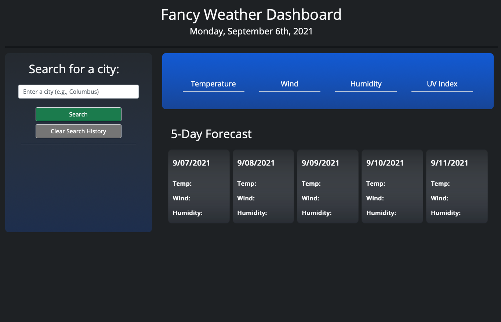
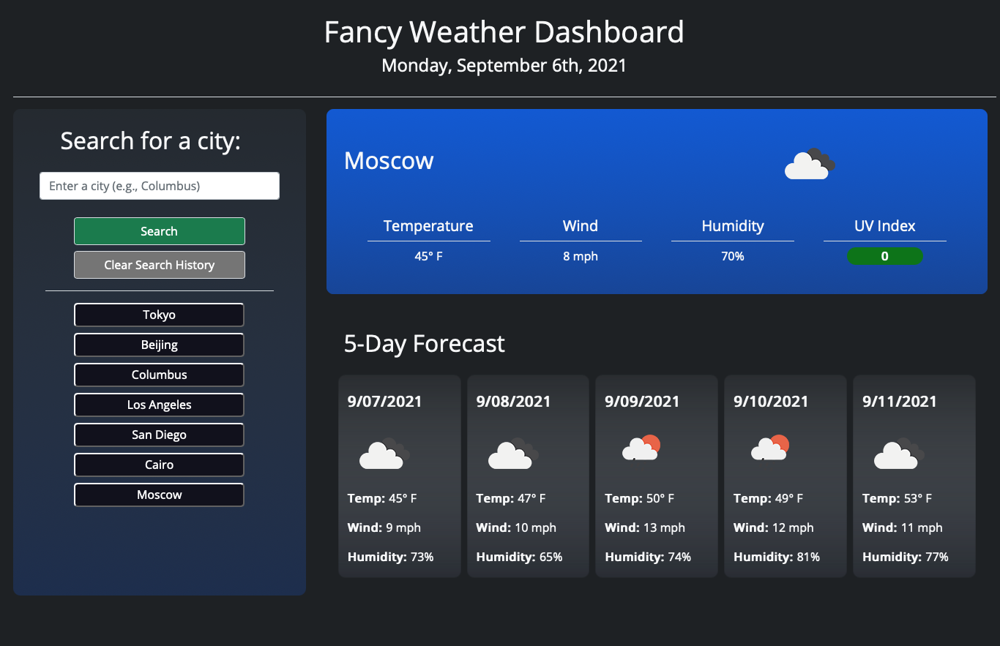

# Fancy-Weather-App

This is a simple application that allows the user to search and view weather information for a city they search for. The user will automatically have searches saved into a list of buttons that are clickable to research on that city (the history can be cleared). Please see below for more detailed steps in how the user interacts with this application.

## How does this application work?
**Below is a detailed breakdown of how this application works:**

1. The user opens the application using the Live URL link below.

2. Upon using this application for the first time, the user will see today's date, a search input and empty content boxes where weather data will be filled in.

3. When the user enters a city in the search bar and either clicks the "Search" button or hits enter, they will be presented with current weather data as well as a 5-day forecast for that city
    - If the user enters an invalid city, they will get an alert message and be told to try again

4. A button will be generated for the city that was searched and appended to a list below representing the user's search history. The user can click these buttons to search those cities again later (the cities are saved in the user's local storage). 
    - If the user wants to clear the search history, they can click the "Clear Search History" button.

5. For the current weather, the user will see the City name, an icon representing the weather, the temperature in Fahrenheit, the wind, humidity, and UV Index.

6. For the UV Index, there are color indicators for a good, okay, or bad index
    - UV Index less than 3 is green for good
    - UV Index less than 7 is orange for okay
    - UV Index above 7 is red for bad

7. For the forecast, the user will see the date, the weather icon, the temperature in Fahrenheit, the wind and the humidity

8. If the user refreshes the page, the app will fill with the city that is at the top of the user's search history

## Accessing the application
Below are the links to the live application (.io URL) and the link to the Github Repo.

**Live URL:** https://bckasper.github.io/Fancy-Weather-App/ 

**Github Repo:** https://github.com/bckasper/Fancy-Weather-App

## Screenshots
### Screenshot of a new, blank screen
 

### Screenshot of a screen with several saved cities

## Sources used in this application
1. Data was sourced from the Open Weather Map API: (https://openweathermap.org/api)

2. Styling was primarly created through Bootstrap CSS framework (https://getbootstrap.com/docs/5.1/getting-started/introduction/)

3. Primary font was the "Open Sans" font from Google Fonts (https://fonts.googleapis.com/css2?family=Open+Sans&display=swap)